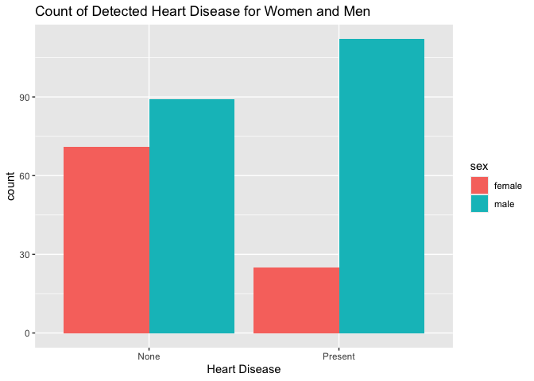
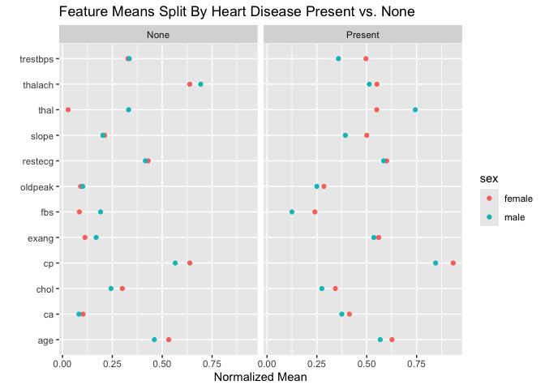

Heart Disease Indicators by Sex
================
2024-07-18

## Introduction

Heart disease is a leading cause of mortality worldwide, yet significant
gender disparities exist in its study and treatment. Historically,
research has predominantly focused on male patients, resulting in
diagnostic and treatment protocols that do not fully address the unique
ways in which heart disease manifests in women. This oversight has led
to a critical gap in our understanding and care of heart disease in
women.

The original data can me found
[here](https://archive.ics.uci.edu/dataset/45/heart+disease). I have
already saved it as a csv file and will be accessing this file. Mutliple
researchers have explored this data and gotten good predictions on the
data!

**The goal of this project is not to maximize prediction accuracy, but
to explore how sex plays a role in heart disease indicators.** By doing
so, we aim to provide medical professionals with deeper insights into
the early indicators of heart disease and ensure that sex-specific
factors are considered for improved diagnosis and treatment.

To get started lets read in the data and take a look at the first 5
rows.

``` r
packages <- c("tidyr", "readxl", "dplyr", "magrittr", "purrr", 
              "ggplot2", "stringr", "snakecase", "knitr") 
invisible(lapply(packages, require, character.only = TRUE ))
```

``` r
df_raw <- read.csv("data/heart_disease.csv")
kable(df_raw[1:5,], caption = "Raw Data")
```

| age | sex |  cp | trestbps | chol | fbs | restecg | thalach | exang | oldpeak | slope |  ca | thal | num |
|----:|----:|----:|---------:|-----:|----:|--------:|--------:|------:|--------:|------:|----:|-----:|----:|
|  63 |   1 |   1 |      145 |  233 |   1 |       2 |     150 |     0 |     2.3 |     3 |   0 |    6 |   0 |
|  67 |   1 |   4 |      160 |  286 |   0 |       2 |     108 |     1 |     1.5 |     2 |   3 |    3 |   2 |
|  67 |   1 |   4 |      120 |  229 |   0 |       2 |     129 |     1 |     2.6 |     2 |   2 |    7 |   1 |
|  37 |   1 |   3 |      130 |  250 |   0 |       0 |     187 |     0 |     3.5 |     3 |   0 |    3 |   0 |
|  41 |   0 |   2 |      130 |  204 |   0 |       2 |     172 |     0 |     1.4 |     1 |   0 |    3 |   0 |

Raw Data

``` r
na_cols <- names(which(colSums(is.na(df_raw)) > 0))
print(na_cols)
```

    ## [1] "ca"   "thal"

The data consists of 14 columns, including `num` which is our heart
disease number. Two of these columns have `NA` values: `ca` and `thal`.
Lets clean up the data and start exploring what we have.

## Data Cleaning and Initial Observations

First, let’s label the data in an easier way to understand for `num`
(heart disease), and `sex`.

``` r
# Add yes/no heart disease column
# Label sex as male/female for convenience
df <- df_raw %>% 
  mutate( heart_disease = case_when(
    num == 0 ~"Present", T ~"None"),
    sex = case_when(sex==1 ~"male", T ~"female"))

# View data with NA values
kable(df %>% filter(if_any(everything(), is.na)))
```

| age | sex    |  cp | trestbps | chol | fbs | restecg | thalach | exang | oldpeak | slope |  ca | thal | num | heart_disease |
|----:|:-------|----:|---------:|-----:|----:|--------:|--------:|------:|--------:|------:|----:|-----:|----:|:--------------|
|  53 | female |   3 |      128 |  216 |   0 |       2 |     115 |     0 |     0.0 |     1 |   0 |   NA |   0 | Present       |
|  52 | male   |   3 |      138 |  223 |   0 |       0 |     169 |     0 |     0.0 |     1 |  NA |    3 |   0 | Present       |
|  43 | male   |   4 |      132 |  247 |   1 |       2 |     143 |     1 |     0.1 |     2 |  NA |    7 |   1 | None          |
|  52 | male   |   4 |      128 |  204 |   1 |       0 |     156 |     1 |     1.0 |     2 |   0 |   NA |   2 | None          |
|  58 | male   |   2 |      125 |  220 |   0 |       0 |     144 |     0 |     0.4 |     2 |  NA |    7 |   0 | Present       |
|  38 | male   |   3 |      138 |  175 |   0 |       0 |     173 |     0 |     0.0 |     1 |  NA |    3 |   0 | Present       |

``` r
# Remove NAs
df %<>% drop_na()

# Plot heart disease vs. no disease 
ggplot(df, aes(x = heart_disease, fill = sex))+
  geom_bar(position = position_dodge())+
  ggtitle("Count of Detected Heart Disease for Women and Men")+xlab("Heart Disease")
```

<!-- -->

``` r
# Heart Disease numbers by sex
men <- paste0("Men with HD:  ", df %>% filter(sex == 'male', heart_disease == 'Present') %>% nrow())
women <- paste0("Women with HD:  ", df %>% filter(sex == 'female', heart_disease == 'Present') %>% nrow())
stats_to_print <- paste(men, women, sep = "\n")

cat(stats_to_print[1])
```

    ## Men with HD:  89
    ## Women with HD:  71

``` r
normalize <- function(x) {
  return ((x - min(x)) / (max(x) - min(x)))
}

# Plot avg across all features for men and women
df %>% select(-num) %>% mutate_at(vars(-sex, -heart_disease), normalize)%>% 
  group_by(sex, heart_disease) %>%  summarise_all(mean) %>%  ungroup() %>% 
  pivot_longer(cols= !c("sex", "heart_disease"), names_to = 'feature', values_to = 'mean') %>% 
  ggplot()+
  geom_point(aes(x = feature, y = mean, color = sex))+coord_flip()+facet_wrap(.~heart_disease)+ xlab("")+ylab("Normalized Mean")+
  ggtitle("Feature Means Split By Heart Disease Present vs. None")
```

<!-- -->

During the data cleaning process, six data points were removed due to
missing information. While imputation methods could be considered to
address this issue, for the purpose of this project, I have chosen to
omit this step. The primary goal here is to understand the impact of sex
on predicting heart disease, rather than achieving the highest possible
prediction accuracy.

An initial review of the dataset reveals a significant gender imbalance,
with more men represented in the study than women. This is true for both
individuals diagnosed with heart disease and those without. This
disparity is noteworthy and we should keep it in mind as we explore
further as it could potentially lead to a biased understanding of heart
disease indicators and outcomes.

The graph of feature means illustrates differences between feature
expression for those with and without heart disease. Additionally,
certain features, such as `thal`, `oldpeak`, and `exang`, display
distinct variations between men and women. This suggests that the same
approach to finding heart disease indicators may not be equally
effective for both men and women.

## Decision Tree Models

Bringing it back to our original goal, to explore how sex plays a role
in heart disease indicators, I am going to look at a series of decision
trees.

### Why Decision Trees?

Decision trees may not always be the best models that give the highest
predictive accuracy, however I think are a great model to use to help us
understand our problem at hand.

Decision trees are easy to understand and interpret, making the logic
behind the predictions clear. This transparency is particularly valuable
in the medical field, where it is crucial to explain why certain
features are indicative of heart disease. Unlike more complex models
such as neural networks, decision trees do not require dimensionality
reduction, and they can directly use the original features of the
dataset. This simplicity helps maintain the medical terminology and
context, making the results more accessible and actionable for
healthcare professionals.

### Building the Models

To understand how women and men are represented within the model, lets
build three decision trees:

1.  **Full Tree:** This tree will be built using the training set from
    all the data.
2.  **Male Tree:** This tree will be built using the training set from
    the data filtered to `sex == 'male'`.
3.  **Female Tree:** This tree will be built using the training set from
    the data filtered to `sex == 'female'`

All trees will use a 70/30 training/test split, and use the gini index
within the tree.

> I will not be performing any hyper-parameter tuning in this project.
> Please take a look at a one of my more in-depth project, such as [this
> one](https://github.com/lilynorthcutt/sierraNevadaAge), if you are
> interested in this.

## Results and Discussion

## Conclusion and Future Work
